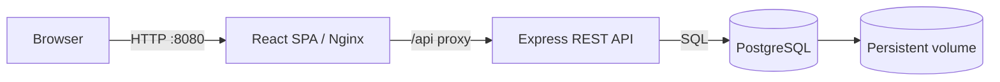

# ExamApp — Online Exam Platform

ExamApp is a full-stack examination platform for teachers and students.
Teachers create, publish, manage, and grade exams. Students take assigned
exams, autosave answers, submit attempts, and view published results.

## Team

> Replace the placeholder IDs below with the correct student IDs before
> submission.

- **Asaf Haberer** — Student ID: `206760381`
- **Eliya Sofer** — Student ID: `322580432`

## Project links

- **GitHub repository:** <https://github.com/asaf1203/ExamApp>
- **Public deployment:** <https://examappdeploy.onrender.com>
- **Local Docker deployment:** <http://localhost:8080>
- **Local API:** <http://localhost:3000/api>
- **Health endpoint:** <http://localhost:3000/health>
- **Docker Hub images:**
  - `asafhab/exam-app-client`
  - `asafhab/exam-app-server`

The Docker Hub username is supplied through GitHub Actions secrets and is not
committed to the repository.

## Main features

### Authentication and shared experience

- Student and teacher sign-in and registration.
- Opaque bearer-token sessions with access and refresh tokens.
- Server-side role and ownership authorization.
- Profile, notifications, dark/light theme, toast messages, and error handling.
- Feature flags and environment/runtime configuration.
- Browser mock mode and real HTTP/PostgreSQL mode.

### Student portal

- Dashboard for assigned, available, upcoming, active, and completed exams.
- Exam instructions, availability windows, duration, and attempt limits.
- Four question types: single choice, multiple choice, short text, and long
  text.
- Countdown timer, autosave, activity tracking, and automatic expiry
  submission.
- Result page with score breakdown, teacher feedback, and attempt history.

### Teacher portal

- Dashboard with exam statistics, activity, submissions, and grading workload.
- Create, edit, preview, duplicate, publish, unpublish, archive, and delete
  exams.
- Question editor and configurable question types.
- Submission inbox with search and status filtering.
- Save grading drafts, complete grading, publish results, and hide results.

## Technology

- **Client:** React 19, Vite 8, Bootstrap 5, Nginx
- **Server:** Node.js 22, Express 5
- **Database:** PostgreSQL 16 with JSONB
- **Testing:** Vitest, Testing Library, Node test runner, Supertest
- **Infrastructure:** Docker, Docker Compose, GitHub Actions, Gitleaks

## Architecture summary



The React client calls service facades, which send JSON requests through a
central API client. Nginx proxies `/api` to Express. Express validates bearer
tokens, enforces roles and resource ownership, runs exam workflows, and maps
domain objects to PostgreSQL through the repository layer.

## Primary pages

### Student

- `#/student` — dashboard
- `#/student/profile` — profile
- `#/student/exams/:examId/instructions` — instructions
- `#/student/exams/:examId/take/:attemptId` — exam taking
- `#/student/results/:attemptId` — results

### Teacher

- `#/teacher` — dashboard
- `#/teacher/exams` — exam list
- `#/teacher/exams/new` — create exam
- `#/teacher/exams/:examId/edit` — edit exam
- `#/teacher/exams/:examId/preview` — preview exam
- `#/teacher/question-types` — question-type settings
- `#/teacher/submissions` — submissions
- `#/teacher/submissions/:submissionId` — grading review

## Primary API groups

- `/api/auth/*` — authentication and sessions
- `/api/student/*` — assigned exams, attempts, drafts, submission, and results
- `/api/teacher/*` — dashboard, exam lifecycle, submissions, and grading
- `/api/notifications/*` — user notifications
- `/api/users`, `/api/exams`, `/api/scores` — teacher-protected compatibility
  endpoints
- `/health` — service health

See [API and Database](documentation/API_AND_DATABASE.md) for the complete
endpoint list, authorization rules, ERD, and JSON models.

## Quick start with Docker

### Prerequisite

Install Docker Desktop or start a compatible Docker runtime such as Colima.

```sh
colima start
```

### Build and start

```sh
docker compose up --build -d --wait
```

Open <http://localhost:8080>.

Demo accounts:

- Teacher: `teacher@example.com` / `teacher123`
- Student: `student@example.com` / `student123`

Stop the deployment:

```sh
docker compose down
```

Add `-v` only when the PostgreSQL data volume should also be deleted.

## Local development

```sh
npm ci
npm --prefix client ci
```

Prepare PostgreSQL:

```sh
createdb exam_app
cp .env.example .env
npm run db:schema
npm run db:seed
```

Start the API and client in separate terminals:

```sh
npm run dev
npm run client:dev:server
```

- Client: <http://localhost:5173>
- API: <http://localhost:3000>

## Testing

```sh
# Client
npm --prefix client test -- --run
npm --prefix client run lint

# Server authorization
npm run test:auth

# Database
npm run db:test
npm run db:compat

# Running Docker deployment
npm run test:deploy
```

## CI/CD summary

GitHub Actions provides:

- Gitleaks secret scanning.
- API authorization integration tests.
- Docker Compose build and deployment smoke tests.
- Daily client/server image builds and Docker Hub publishing.

## Detailed documentation

- [Architecture](documentation/ARCHITECTURE.md) — client/server patterns,
  dependencies, component hierarchy, UML, and sequence diagrams.
- [API and Database](documentation/API_AND_DATABASE.md) — endpoint reference,
  authorization, ERD, tables, JSON models, and persistence mapping.
- [Development and Deployment](documentation/DEVELOPMENT_AND_DEPLOYMENT.md) —
  configuration, local development, Docker, testing, CI/CD, and logging.
- [Project Process](documentation/PROJECT_PROCESS.md) — repository structure,
  branching strategy, semester milestones, and architectural evolution.

## Important production limitations

- Demo passwords are stored in plain text and must be hashed for production.
- Public registration currently permits selecting the teacher role.
- Snapshot persistence should be replaced with targeted SQL for concurrent
  production traffic.
- Password reset is a placeholder.
- Question-type HTTP endpoints are not yet implemented.
