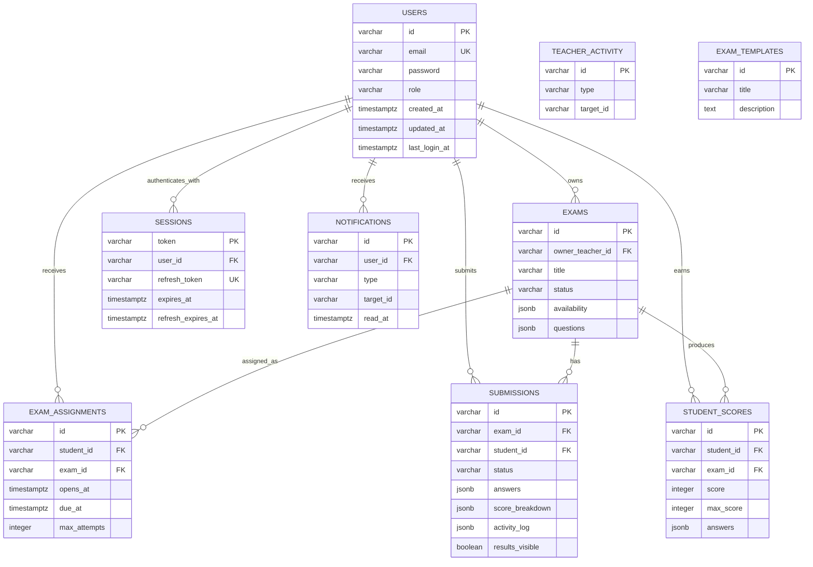

# API and Database

[Back to main README](../README.md)

## API conventions

The Express API is mounted under `/api`. Protected endpoints expect:

```http
Authorization: Bearer <session-token>
```

Errors use a normalized JSON shape:

```json
{
  "code": "AUTH_REQUIRED",
  "message": "Authentication required.",
  "details": null
}
```

## Endpoints

### Public and authentication

- `GET /health`
- `GET /api/`
- `GET /api/config`
- `POST /api/auth/login`
- `POST /api/auth/signup`
- `GET /api/auth/me` — authenticated
- `POST /api/auth/logout`
- `POST /api/auth/refresh`
- `POST /api/auth/password-reset` — placeholder

### Teacher/admin compatibility API

These legacy endpoints require the `teacher` role and operate on the complete
store:

- `GET`, `POST /api/users`
- `GET`, `PUT`, `DELETE /api/users/:userId`
- `GET /api/db`
- `POST /api/db/reset`
- `GET`, `POST /api/exams`
- `GET`, `PUT`, `DELETE /api/exams/:examId`
- `GET /api/scores`
- `GET /api/exams/:examId/scores`

### Student API

All endpoints require the `student` role and scope resources to the current
student:

- `GET /api/student/exams`
- `GET /api/student/exams/:examId`
- `POST /api/student/exams/:examId/attempts`
- `GET /api/student/attempts/:attemptId`
- `PUT /api/student/attempts/:attemptId/draft`
- `POST /api/student/attempts/:attemptId/submit`
- `GET /api/student/attempts/:attemptId/result`
- `GET /api/student/activity`
- `POST /api/student/attempts/:attemptId/activity`

### Teacher workflow API

All endpoints require the `teacher` role. Exam and submission routes are scoped
to resources owned by the current teacher:

- `GET /api/teacher/dashboard`
- `GET`, `POST /api/teacher/exams`
- `GET`, `PUT`, `DELETE /api/teacher/exams/:examId`
- `PUT /api/teacher/exams/:examId/draft`
- `POST /api/teacher/exams/:examId/duplicate`
- `POST /api/teacher/exams/:examId/publish`
- `POST /api/teacher/exams/:examId/unpublish`
- `POST /api/teacher/exams/:examId/archive`
- `GET /api/teacher/submissions`
- `GET /api/teacher/submissions/:submissionId`
- `PUT /api/teacher/submissions/:submissionId/grades`
- `POST /api/teacher/submissions/:submissionId/complete`
- `POST /api/teacher/submissions/:submissionId/publish`
- `POST /api/teacher/submissions/:submissionId/hide`

### Notifications

Any authenticated user:

- `GET /api/notifications`
- `POST /api/notifications/read`

### Known API gap

The client references the following question-type routes, but Express does not
implement them yet:

- `GET /api/teacher/question-types`
- `PUT /api/teacher/question-types`
- `POST /api/teacher/question-types/reset`

The feature currently uses browser storage in mock mode.

## PostgreSQL schema

PostgreSQL is the durable source of truth. Foreign keys enforce core
relationships; JSONB preserves nested questions, answers, grading, and activity
objects expected by the client.

### Entity Relationship Diagram



`teacher_activity` and `exam_templates` have no foreign-key columns.

## Table responsibilities

### `users`

Stores identity, email, password, role (`student` or `teacher`), and timestamps.
Passwords are plain text in this educational implementation and must be hashed
before production use.

### `exams`

Stores exam metadata, lifecycle status, owner teacher, availability JSONB, and
the nested `questions` JSONB array.

### `exam_assignments`

Links students to exams and stores availability windows, instructions, and
attempt limits. `(student_id, exam_id)` is unique.

### `submissions`

Represents exam attempts. Stores answer maps, status, scores, result visibility,
feedback, timestamps, score breakdown JSONB, and activity log JSONB.

### `student_scores`

Stores denormalized score/reporting records. Live workflows are driven mainly
by `submissions`.

### `sessions`

Stores opaque access token, unique refresh token, user relation, and expiry
timestamps.

### `notifications`

Stores user-scoped messages and read timestamps.

### `teacher_activity` and `exam_templates`

Support the teacher dashboard feed and reusable exam templates.

## JSON models

### Public user

```json
{
  "id": "STU-12",
  "name": "Maya Rosen",
  "email": "student@example.com",
  "role": "student",
  "createdAt": "2026-06-01T10:00:00.000Z",
  "updatedAt": "2026-06-01T10:00:00.000Z",
  "lastLoginAt": null
}
```

### Exam

```json
{
  "id": "EX-101",
  "ownerTeacherId": "TCH-1",
  "title": "Web Development Fundamentals",
  "status": "published",
  "durationMinutes": 60,
  "passingGrade": 70,
  "maxAttempts": 1,
  "visibilityScope": "assigned",
  "availability": {
    "opensAt": "2026-07-01T08:00:00.000Z",
    "dueAt": "2026-07-31T20:00:00.000Z"
  },
  "questions": [
    {
      "id": "Q-101-1",
      "type": "single-choice",
      "prompt": "Which HTTP method commonly creates a resource?",
      "points": 10,
      "options": [
        { "id": "GET", "label": "GET" },
        { "id": "POST", "label": "POST" }
      ],
      "correctAnswer": "POST"
    }
  ]
}
```

Correct answers and grading hints are removed from student-facing exam-taking
responses.

### Submission

```json
{
  "id": "ATT-101",
  "examId": "EX-101",
  "studentId": "STU-12",
  "attemptNumber": 1,
  "status": "submitted",
  "answers": {
    "Q-101-1": "POST",
    "Q-101-2": ["localStorage"]
  },
  "score": 18,
  "maxScore": 20,
  "resultsVisible": false,
  "scoreBreakdown": [
    {
      "questionId": "Q-101-1",
      "score": 10,
      "maxScore": 10,
      "feedback": "Correct answer."
    }
  ],
  "activityLog": [
    {
      "type": "submitted",
      "message": "Exam submitted by student.",
      "createdAt": "2026-07-19T12:00:00.000Z"
    }
  ],
  "teacherFeedback": ""
}
```

### Session

```json
{
  "token": "opaque-access-token",
  "refreshToken": "opaque-refresh-token",
  "userId": "STU-12",
  "issuedAt": "2026-07-19T10:00:00.000Z",
  "expiresAt": "2026-07-19T11:00:00.000Z",
  "refreshExpiresAt": "2026-07-26T10:00:00.000Z"
}
```

## Persistence mapping

The repository maps SQL snake_case fields to client-compatible camelCase:

- `examAssignments` ↔ `exam_assignments`
- `examAttempts` ↔ `submissions`
- `studentScores` ↔ `student_scores`
- `teacherActivity` ↔ `teacher_activity`
- `examTemplates` ↔ `exam_templates`

`exams.questions`, `exams.availability`, `submissions.answers`,
`submissions.score_breakdown`, `submissions.activity_log`, and
`student_scores.answers` are JSONB.
