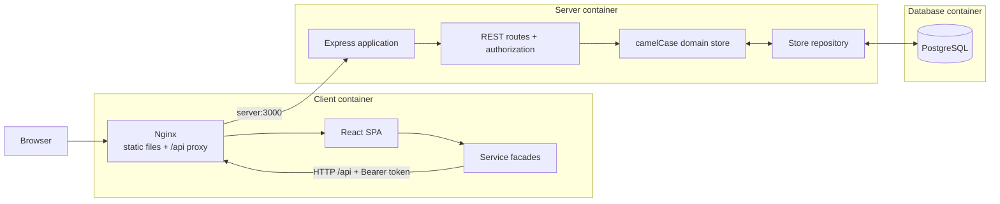
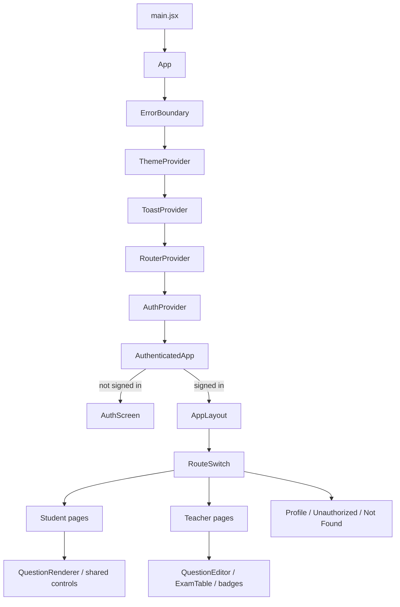
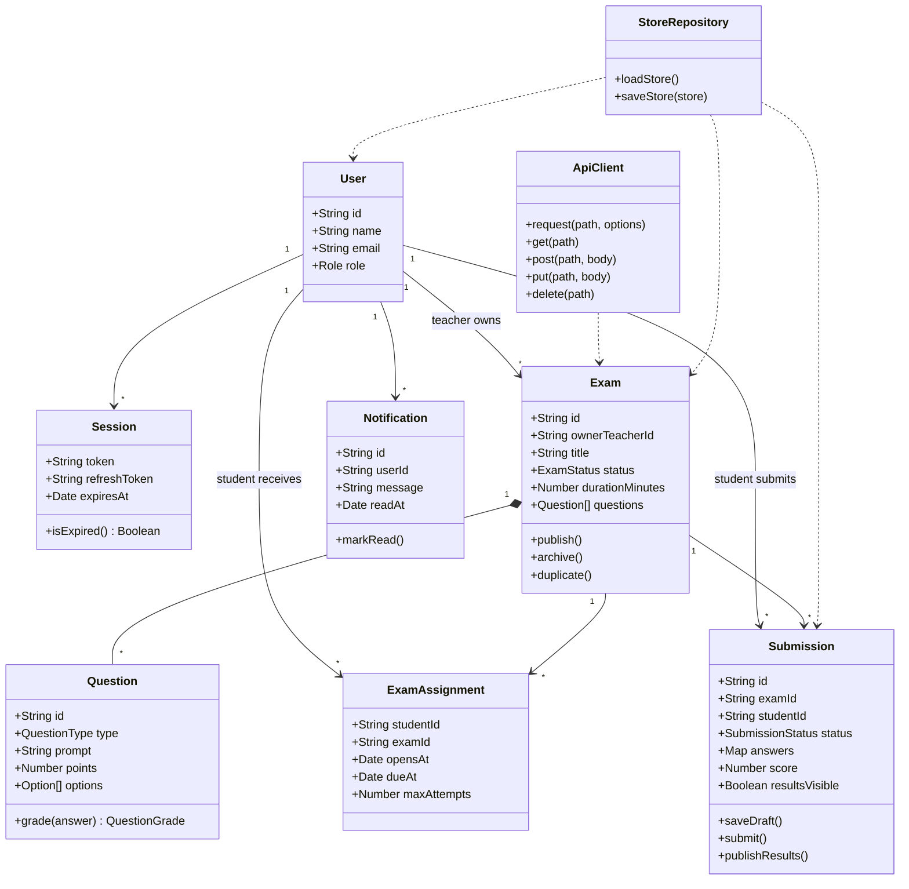
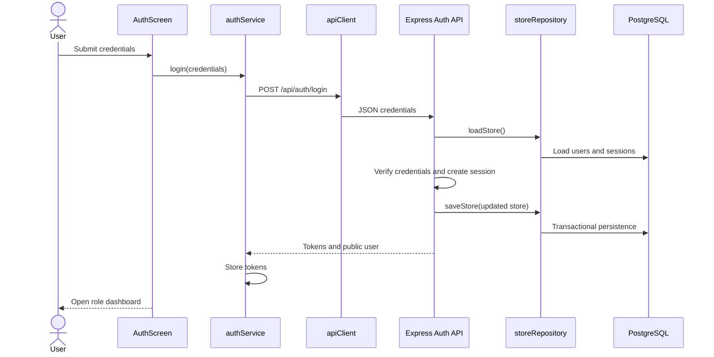
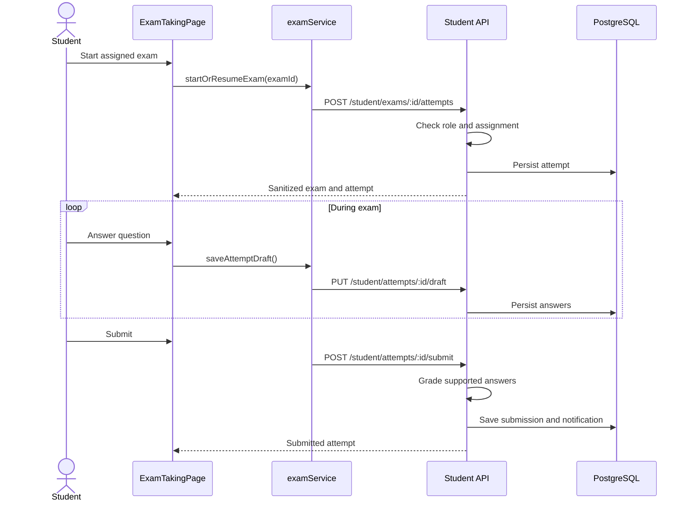
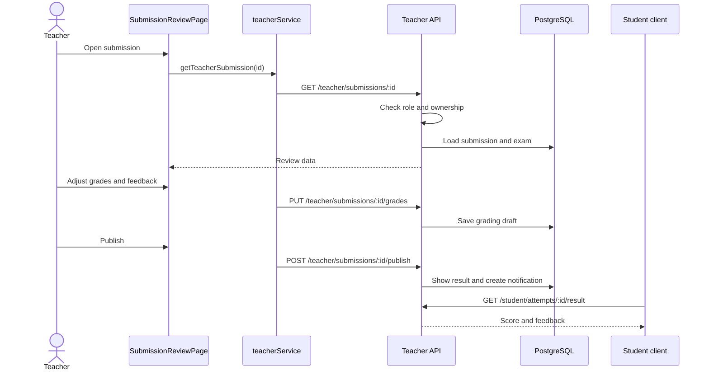

# ExamApp Architecture

[Back to main README](../README.md)

## High-level architecture

ExamApp is a three-tier application:

- **Client:** React 19 SPA built with Vite and served by Nginx.
- **Server:** Express 5 REST API running on Node.js 22.
- **Database:** PostgreSQL 16.
- **Services:** client-side service facades, authentication, exam workflows,
  grading, notifications, configuration, and persistence mapping.



## Component interaction and data flow

1. The browser loads the React bundle from Nginx.
2. React pages call service facades instead of storage directly.
3. In HTTP mode, `apiClient` sends JSON requests to `/api` and attaches the
   current bearer token.
4. Nginx proxies `/api/*` to the Express service using Docker DNS name `server`.
5. Express loads PostgreSQL data into the domain store, authenticates the user,
   enforces role and ownership rules, and executes the requested operation.
6. Successful mutations are persisted through `storeRepository`.
7. Responses are mapped to camelCase JSON consumed by the client.

## Storage responsibilities

- Users and roles: `users`
- Access and refresh sessions: `sessions`
- Exam definitions and nested questions: `exams`
- Student-to-exam access: `exam_assignments`
- Attempts, answers, grades, and activity: `submissions`
- Reporting score records: `student_scores`
- User messages: `notifications`
- Teacher dashboard feed and templates: `teacher_activity`, `exam_templates`
- Development mock mode: browser storage through `client/src/api/mockDb.js`

## Client architecture

### Packages

Runtime:

- `react`, `react-dom`
- `bootstrap`

Development:

- `vite`, `@vitejs/plugin-react`
- `vitest`, `jsdom`, `@testing-library/react`,
  `@testing-library/jest-dom`
- `eslint` and React ESLint plugins

### Pattern

The client uses a **feature-sliced component architecture** with a
**service/repository facade**:

- React pages/components form the presentation layer.
- Context providers and hooks manage shared application behavior.
- Service modules expose stable domain operations.
- `apiClient` centralizes mock/HTTP transport, bearer tokens, caching, retries,
  timeouts, interceptors, and normalized errors.
- Model modules contain domain contracts, constants, factories, and grading
  helpers.

The project uses a custom hash router rather than React Router.

### Component hierarchy



### Important directories

```text
client/src/
├── api/                    # HTTP/mock transport and service facades
├── auth/                   # Authentication context and UI
├── components/             # Shared components
├── config/                 # Environment, validation, defaults, feature flags
├── features/
│   ├── student-exams/      # Student pages and question rendering
│   └── teacher-exams/      # Teacher pages, editor, grading
├── hooks/                  # Countdown, debounce, unload, flags
├── layout/                 # Authenticated application shell
├── models/                 # Domain contracts and helpers
├── pages/                  # Shared pages
├── routing/                # Custom hash router
├── ui/                     # Theme, toast, and error boundary
├── App.jsx
└── main.jsx
```

## Server architecture

### Packages

Runtime:

- `express` — HTTP server and routing
- `pg` — PostgreSQL pool and queries
- `dotenv` — local environment loading

Development:

- `supertest` — API integration tests

### Pattern

The server is a **layered REST application with a snapshot repository**:

- `server.js` — process entry point.
- `server/createApp.js` — CORS, JSON parsing, routes, health checks, optional
  static client hosting.
- `server/mockRoutes.js` — controllers, authorization, and domain workflows.
- `server/mockStore.js` — seed objects and mutable domain store.
- `server/db/storeRepository.js` — PostgreSQL mapping and persistence.
- `server/db/connect.js` — database connection pool.
- `server/db/schema.sql` — relational schema.

In PostgreSQL mode, routes load relational rows into camelCase domain objects.
Successful mutations save the domain store in a transaction. The current
repository deletes and reinserts the complete snapshot; targeted SQL operations
would be preferable for high concurrency and large datasets.

## Authentication and authorization

- Login creates opaque access and refresh tokens in `sessions`.
- The client sends `Authorization: Bearer <token>`.
- `requireUser` validates the session.
- `requireRole` enforces `student` or `teacher`.
- Student resources are scoped to the authenticated student.
- Teacher exams/submissions are scoped to the owning teacher.
- Correct answers are removed from student exam-taking responses.
- Scores and feedback remain hidden until the teacher publishes results.

## Object-oriented domain design

The implementation mainly uses JavaScript objects and modules rather than
runtime classes. This UML describes the logical domain model.



## Key sequence diagrams

### Sign in



### Student submits an exam



### Teacher grades and publishes


